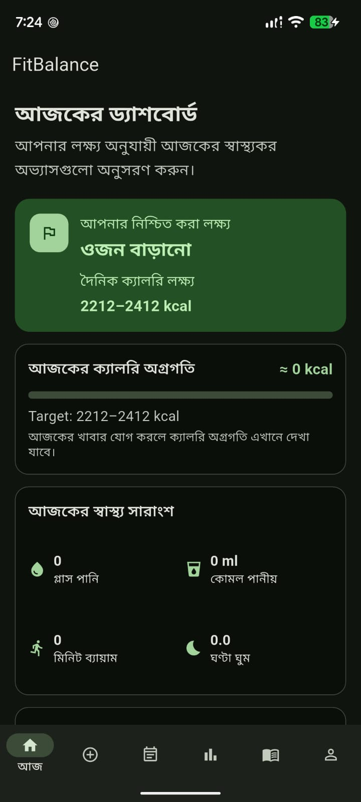
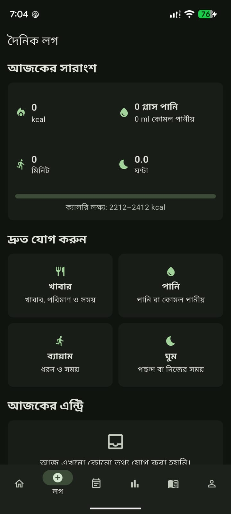
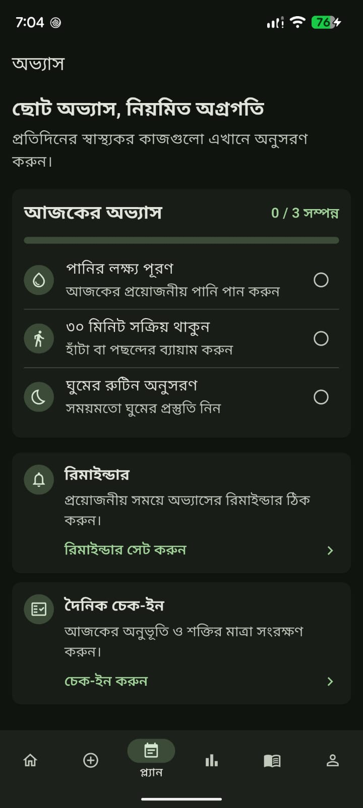
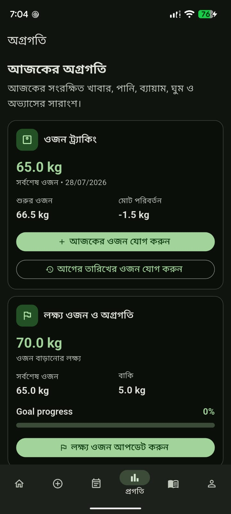
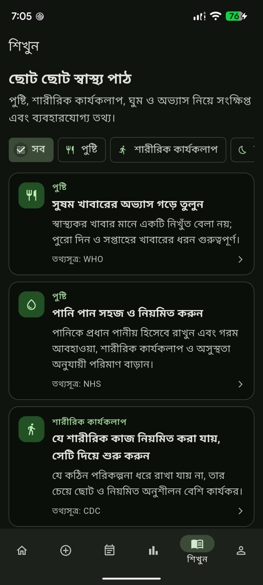
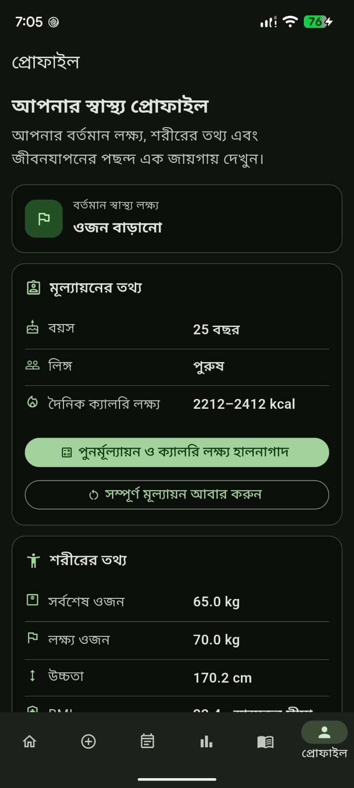
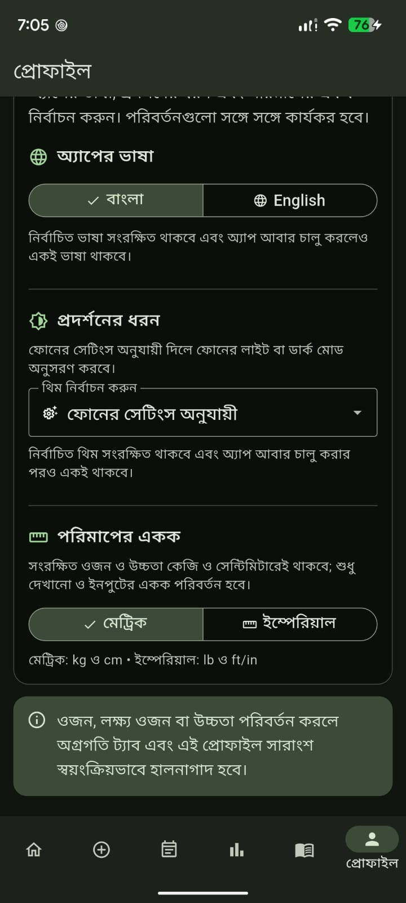
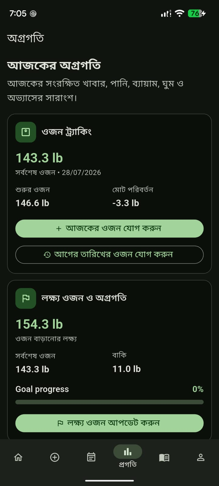

# FitBalance

**FitBalance** is an Android-first, offline Flutter application for personalized weight and healthy-lifestyle management. It combines a bilingual Bangla/English experience with calorie-target estimation, daily health logging, habit tracking, local reminders, progress insights, unit conversion, persistent app settings, and privacy-focused local data deletion.

> **Portfolio status:** Working solo MVP with physical-device regression testing and automated tests.

## Highlights

- **Bilingual UI:** Bangla and English across onboarding and core screens.
- **Personalized calorie targets:** Uses age, sex, height, weight, activity, and goal inputs.
- **Daily health log:** Meals, water, soft drinks, exercise, and sleep.
- **Habit engine:** Three fixed health habits, daily completion state, daily check-in, and reminder scheduling.
- **Progress tracking:** Weight history, target-weight progress, BMI, healthy-weight reference range, seven-day summaries and charts.
- **Profile & reassessment:** Update lifestyle preferences and recalculate calorie targets.
- **Metric / Imperial support:** kg/cm and lb/ft-in display/input while canonical values remain metric internally.
- **Persistent appearance:** System, Light, and Dark modes.
- **Offline-first:** Core data is stored locally; no backend, account, or cloud sync is required.
- **Privacy reset:** A user can permanently delete all FitBalance local data and scheduled habit reminders.
- **Quality checks:** Flutter analyzer clean, automated calculation/unit tests, and real-device regression testing.

## Screenshots

<table>
  <tr>
    <td align="center"><b>Today</b><br></td>
    <td align="center"><b>Daily Log</b><br></td>
    <td align="center"><b>Habits</b><br></td>
    <td align="center"><b>Progress</b><br></td>
  </tr>
  <tr>
    <td align="center"><b>Learn</b><br></td>
    <td align="center"><b>Profile</b><br></td>
    <td align="center"><b>App Settings</b><br></td>
    <td align="center"><b>Imperial Units</b><br></td>
  </tr>
</table>

## Tech Stack

- **Flutter 3.44.7**
- **Dart 3.12.2**
- **Android-first mobile target**
- `shared_preferences` for local persistence
- `flutter_local_notifications` for scheduled habit reminders
- `timezone` + `flutter_timezone` for local zoned scheduling
- Material 3 UI
- Git for version control

## Architecture

The project intentionally uses a lightweight solo-MVP structure:

```text
lib/
├── main.dart
├── app.dart
├── screens/
│   ├── app_startup_screen.dart
│   ├── welcome_screen.dart
│   ├── consent_screen.dart
│   ├── personal_info_screen.dart
│   ├── goal_selection_screen.dart
│   ├── lifestyle_assessment_screen.dart
│   ├── assessment_result_screen.dart
│   ├── plan_confirmation_screen.dart
│   ├── dashboard_navigation_screen.dart
│   ├── today_dashboard_screen.dart
│   ├── daily_log_screen.dart
│   ├── habit_engine_screen.dart
│   ├── progress_screen.dart
│   ├── learn_screen.dart
│   ├── profile_screen.dart
│   └── reassessment_screen.dart
└── services/
    ├── onboarding_storage_service.dart
    ├── assessment_profile_storage_service.dart
    ├── profile_preferences_storage_service.dart
    ├── body_metrics_storage_service.dart
    ├── weight_storage_service.dart
    ├── daily_log_storage_service.dart
    ├── habit_storage_service.dart
    ├── notification_service.dart
    ├── calorie_target_calculator.dart
    ├── app_settings_storage_service.dart
    ├── measurement_unit_converter.dart
    └── privacy_reset_service.dart
```

See [Architecture](docs/ARCHITECTURE.md) for the runtime and persistence design.

## Data & Privacy

FitBalance is currently an **offline local-data MVP**:

- No user account or authentication.
- No backend/API dependency for core features.
- No cloud sync.
- Health/profile data is stored locally through SharedPreferences.
- Scheduled reminders are local Android notifications.
- **Delete all FitBalance data** removes the app's local preferences and cancels the three scheduled habit reminder IDs before returning the user to the fresh Welcome/onboarding flow.

For a production health application, the privacy/security model should be reviewed and strengthened before handling real sensitive data at scale.

See [Privacy & Data](docs/PRIVACY.md).

## Testing

The current MVP has been verified with:

- `flutter analyze` — no issues.
- `flutter test` — **8/8 automated tests passed**.
- Calculation tests for `CalorieTargetCalculator`.
- Metric/Imperial conversion and formatting tests.
- Physical-device regression on a **Google Pixel 6a**.
- Reminder scheduling, restart persistence, cancellation, and reset cancellation test.
- Bangla/English, System/Light/Dark, Metric/Imperial, startup restore, Daily Log, habits, Progress, Learn, Profile, reassessment, and navigation checks.
- Full privacy reset followed by fresh onboarding and restart persistence.

See [Testing](docs/TESTING.md).

## Getting Started

### Prerequisites

- Flutter SDK compatible with Dart `^3.12.2`
- Android SDK / Android device or emulator
- Git

### Run locally

```bash
git clone https://github.com/nipunmondolz/fitbalance.git
cd fitbalance
flutter pub get
flutter analyze
flutter test
flutter run
```

## Build an Android APK

Debug:

```bash
flutter build apk --debug
```

Release:

```bash
flutter build apk --release
```

> Release signing/configuration should be verified before distributing a production APK.

## Key Design Decisions

1. **Offline-first MVP:** Core flows remain usable without a backend.
2. **Canonical metric storage:** Weight/height are stored in kg/cm; Imperial is a display/input layer.
3. **Single-device persistence:** Simplifies the MVP while demonstrating state restoration and local data modeling.
4. **Safe assessment restart:** Existing profile data survives an abandoned reassessment/full restart flow until the replacement flow is successfully completed.
5. **Explicit destructive reset:** Permanent local-data deletion requires confirmation and also cancels scheduled reminders.
6. **Bilingual-first UX:** Bangla and English are treated as first-class app states rather than separate builds.

## Current Scope & Limitations

Implemented as a focused solo MVP. The following are intentionally **not** part of the current version:

- Backend or REST API
- Authentication/accounts
- Cloud sync
- Admin dashboard
- AI/ML recommendations
- User-created/custom habits
- Food favorites database
- Weekly generated report
- Social/community features
- Production-grade encrypted health-data storage

See [Project Scope](docs/PROJECT_SCOPE.md).

## Medical Disclaimer

FitBalance provides general lifestyle estimates and tracking tools. It is **not a medical diagnosis, treatment, prescription, or replacement for professional medical care**.

## Portfolio Value

This project demonstrates practical experience with:

- Flutter/Dart mobile development
- Stateful multi-screen UX
- Local persistence and startup restoration
- Android local notifications
- Timezone-aware scheduling
- Data validation and calculation logic
- Unit conversion
- Localization
- Regression testing
- Automated tests
- Git-based incremental development
- Privacy-oriented destructive-data workflows

## Author

Developed as a portfolio project by **Md. Farhan Alavee Nipun**.

- GitHub: https://github.com/nipunmondolz

## License

No open-source license has been selected yet. Add a license before publication if you want to grant reuse, modification, or redistribution rights to others.
